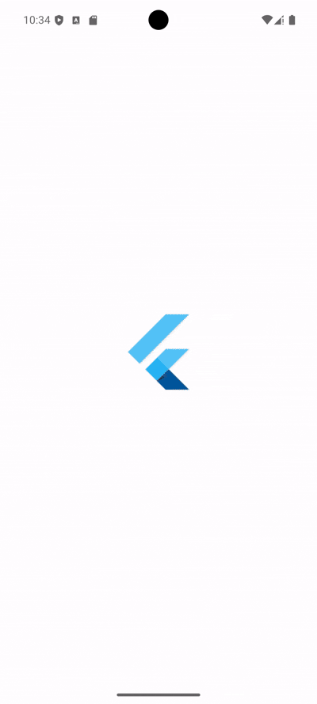
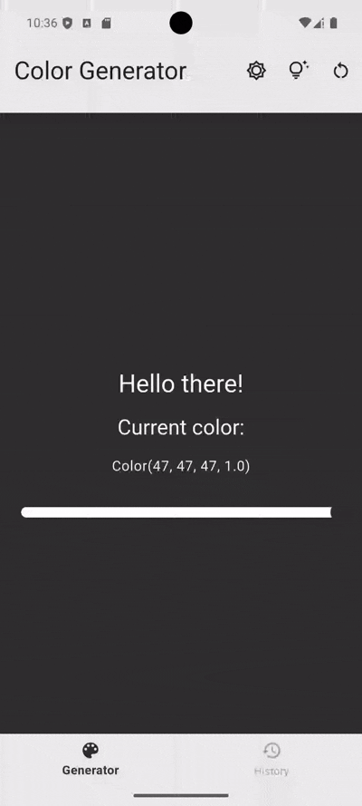
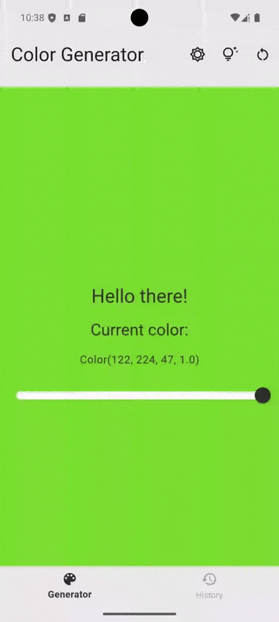
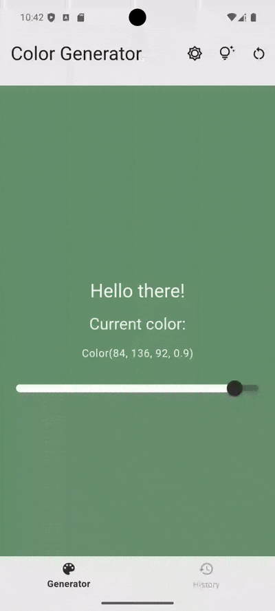
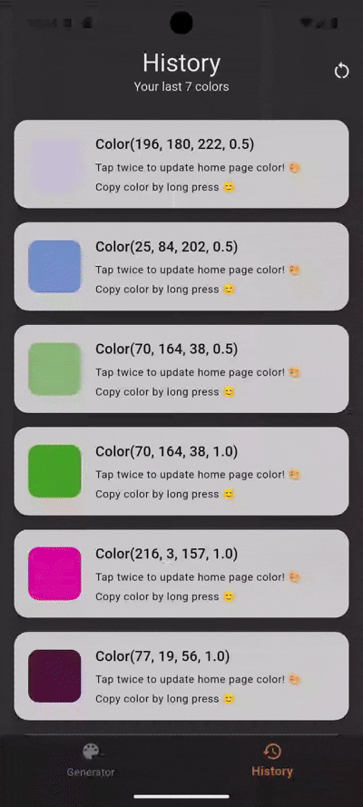
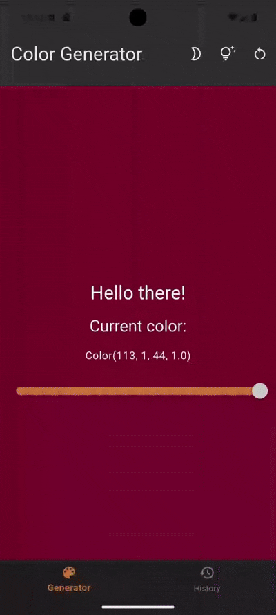

# Flutter Color Generator 🎨

A Flutter app to generate RGBA colors with interactive features for designers and developers.

## Features

- **Two-tab footer** for easy navigation between main screens
- **BLoC** for clean state management
- **Shared Preferences** to save settings and color history
- **Dependency Injection** for better development experience

### What You Can Do

- Launch a **tooltip / guided tour**

- Tap anywhere on the home page to **generate a random RGBA color**
- Display the **color code as text** (long tap to copy)
- Adjust **opacity** with a slider

- **Switch themes** dynamically

- Reset to the **default background color**

- Keep a **history of the last 20 colors**
- Each copyable via long press
- Each could be setted as new background color

- **Clear the entire color history**

## Getting Started

To start the app do the following steps:

- flutter clean
- flutter pub get
- dart run build_runner build --delete-conflicting-outputs
- flutter run
